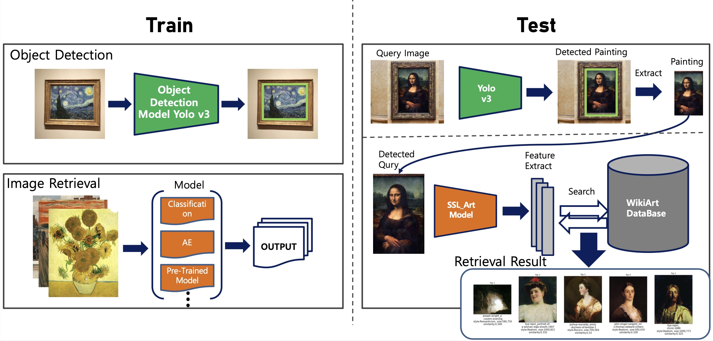

# Art-Painting Retrieval




## Requirements
### Packages
Pillow == 8.4.8, numpy==1.21.4, torch==1.10.1, torchvision==0.11.2, torchaudio==0.10.1, imaug==0.4.0

### Preliminary
Make symbolic link of wikiart dataset on the package data directory
```shell
ln -s /home/dhlee/DATA/wikiart wikiart
```
### Detection Model
We use **yolo-v3** model for detect paining object. Weights of model is released by official yolo Group
at **https://pjreddie.com/darknet/yolo/**. Run below shell code to download the weights of the model
```shell
wget https://pjreddie.com/media/files/yolov3-openimages.weights
```
### Retrieval Model
We trained several art-painting retrieval models. if you want to get our weights of models, 
please email dhlee.ie@yonsei.ac.kr

## Quick Start
```python
from detection.yolov3 import predict
from retrieval.AE import autoencoder
from retrieval.utils import load_db, vis_retrieval
from sklearn.metrics.pairwise import cosine_similarity

## Detect Art-Image
detected_dict = predict(images_loc='./data/detect_input')
detected_dict['./data/detect_input/110.jpg'].keys()
detected_img = detected_dict['./data/detect_input/110.jpg'][0]['img']

## Detected Image Encoding
retrieval_model = autoencoder('./weights/ae_model_50.pth')
_feature = retrieval_model.predict(detected_img)

## Database Retrieval
data_db, db_feature = load_db(db_path='./data/DB/autoencoder')
data_q_sim = cosine_similarity(_feature, db_feature[:, 1:])

## visualization
vis_retrieval(detected_img, data_db, data_q_sim)

```
## result
